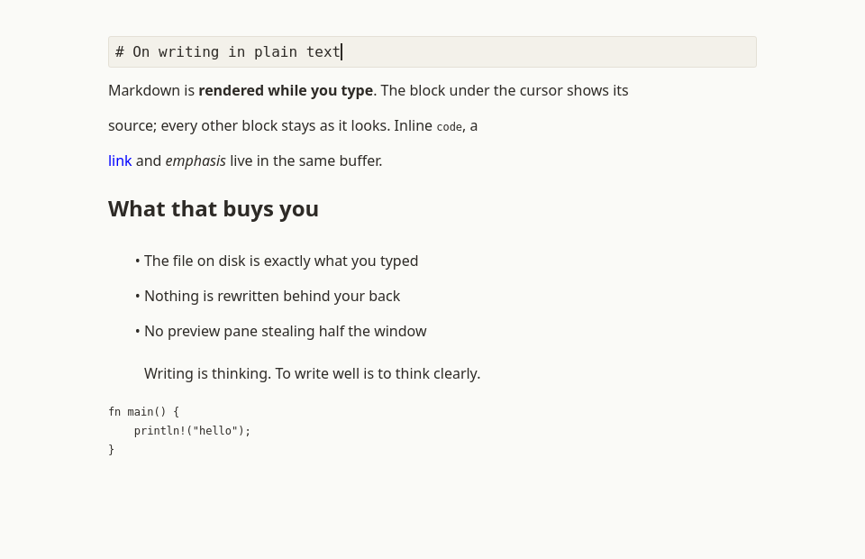

# blogawrite

A minimal markdown editor for Linux. You type markdown and it looks like the finished
page while you type — bold is bold, links are links. Only the block your cursor is in
shows its raw source. Same idea as Typora, in one small window with no menus.



The file on disk stays plain markdown. The editor styles it, it never rewrites it, so
what you saved is what you typed.

## What it does

- Renders as you write — headings, lists, quotes, tables, code fences, links, images
- No split screen, no preview pane
- Ctrl+B / Ctrl+I / Ctrl+U for bold, italic, strikethrough; Ctrl+Shift+L for a link,
  Ctrl+Shift+I for an image
- Ctrl+S to save. Nothing is written until you do, and it asks before closing on
  unsaved changes
- Remembers where you left off in each file
- One window, one document, keyboard only

## Install

A single file that carries its own Qt. Nothing to install, nothing left behind.

```sh
curl -LO https://github.com/ilia-iliev/blogawrite/releases/latest/download/blogawrite-x86_64.AppImage
chmod +x blogawrite-x86_64.AppImage
./blogawrite-x86_64.AppImage post.md
```

That URL always serves the newest release. `SHA256SUMS` sits beside it on the
[releases page](https://github.com/ilia-iliev/blogawrite/releases) if you want to check
the download.

To keep it around, put it on your path under the plain name and install the desktop
file — markdown files then offer it under "Open with":

```sh
install -Dm755 blogawrite-x86_64.AppImage ~/.local/bin/blogawrite
curl -fsSLO https://raw.githubusercontent.com/ilia-iliev/blogawrite/main/blogawrite.desktop
install -Dm644 blogawrite.desktop ~/.local/share/applications/blogawrite.desktop
```

x86_64 only, built against glibc 2.35 — Debian 12, Ubuntu 22.04, Fedora 36 and newer.
It picks Wayland or X11 at startup; override with `QT_QPA_PLATFORM=wayland` or `xcb`.
The window border is left to the window manager, which suits i3 and sway. GNOME draws
none, so set `QT_WAYLAND_DISABLE_WINDOWDECORATION=0` there to get a title bar.

## Using it

```sh
blogawrite post.md
```

The path is required — there is no file picker, and no open, new or save-as. A path
that does not exist yet opens an empty document that the first save creates.

Blocks behave differently while the cursor sits in them:

| Block | While you edit it |
| --- | --- |
| paragraph, list | stays rendered; `**`, `*`, `` ` ``, `~~` and `[…](…)` appear only around the thing under the cursor |
| fenced code | stays rendered, fences appear at the first and last line |
| heading, quote, table, rule | opens up into raw markdown |
| lone image | keeps the picture, with its `` line underneath |

Other keys:

| Key | Does |
| --- | --- |
| PageUp / PageDown | a screenful, selecting the block at the far edge |
| Up / Down | at the first or last line, move to the neighbouring block |
| Backspace | at the start of a block, merge it into the one before |
| Enter twice | end the block and start a new one |

Closing with unsaved changes asks at the foot of the window: `y` saves and closes, `n`
discards, `esc` goes back.

## Rough edges

- Three or more blank lines between blocks collapse to one on save. Block contents are
  untouched.
- Undo is per block — it resets when you leave one.
- An image inside a paragraph shows its alt text while you edit that paragraph.
- Hidden markers are squeezed rather than removed, so a marker leaves a fraction of a
  pixel behind.

## Build from source

Needs Rust 1.85+, a C++ compiler, and Qt 6.2+ with QtQuick.

```sh
# Debian / Ubuntu — QtQuick pulls in the last three at runtime whether you import
# them yourself or not
sudo apt install build-essential qt6-base-dev qt6-declarative-dev qt6-wayland \
    qml6-module-qtquick qml6-module-qtqml-workerscript \
    qml6-module-qtquick-window qml6-module-qtquick-shapes
# Fedora
sudo dnf install gcc-c++ qt6-qtbase-devel qt6-qtdeclarative-devel qt6-qtwayland
# Arch
sudo pacman -S base-devel qt6-base qt6-declarative qt6-wayland
```

```sh
cargo build --release
install -Dm755 target/release/blogawrite ~/.local/bin/blogawrite
install -Dm644 blogawrite.desktop ~/.local/share/applications/blogawrite.desktop
install -Dm644 packaging/blogawrite.svg \
    ~/.local/share/icons/hicolor/scalable/apps/blogawrite.svg
```

It's a Rust core over a Qt Quick UI via [cxx-qt](https://github.com/KDAB/cxx-qt),
rendered by Qt's own `Text.MarkdownText`.

`packaging/build-appimage.sh` builds the AppImage: it packs the release binary with the
Qt it needs — both the X11 and the Wayland platform plugins, so the qtwayland packages
are needed to build it even if you only run X11 — then opens a document offscreen to
check the bundle is whole. Build it on the oldest distro you mean to support; glibc is
the one thing an AppImage cannot bring along. Tagging `v*` runs the same script on
Ubuntu 22.04 and attaches the result to a release.

## License

MIT. See [LICENSE](LICENSE).
